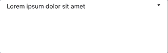
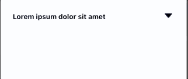

# react-native-collapsible-row

## Installation

```bash
$ npm install react-native-collapsible-row --save
```

## Basic Usage
```javascript

<CollapsibleView
  isDefaultHeader
  title="Lorem ipsum dolor sit amet"
  max={5000}
  min={400}      
  style={{ flex: 1 }}
>
  <View style={{ color: '#FFFFFF', fontSize: 15, fontWeight: 'bold' }}>
    <Text color="page_bg_color" size={15} weight="BOLD">Lorem ipsum dolor sit amet, consectetur adipiscing elit. Vestibulum tempor eros cursus tempor rutrum.</Text>
  </View>
</CollapsibleView>

```



## More Detailed Usage
```javascript
import CollapsibleView from "react-native-collapsible-row";

collapsibleContainer: { flex: 1 },

headerStyle: {
  flexDirection: 'row',
  justifyContent: 'space-between',
  maxHeight: 300,
  alignItems: 'center',
},

titleStyle: {
  marginLeft: 15,
  marginTop: 5,
  width: '80%',
  fontWeight: 'bold',
},

qContainer: {
  marginVertical: 7,
  width: '95%',
  alignSelf: 'center',
  borderRadius: 10,
},

answerViewStyle: {
  width: '90%',
  alignItems: 'flex-start',
  alignSelf: 'center',
  marginVertical: 5,
},

answerTextStyle: {
  color: '#FFFFFF',
  fontSize: 15,
  fontWeight: 'bold',
},

<CollapsibleView
  isDefaultHeader
  defaultHeaderStyle={styles.headerStyle}
  useStyledArrows
  title="Lorem ipsum dolor sit amet"
  titleStyle={styles.titleStyle}
  container={styles.qContainer}
  max={5000}
  min={400}
  titleTextExpandedColor="#FFFFFF"
  titleTextClosedColor="#464B6D"
  expandedColor="#464B6D"
  closedColor="#E6E9FC"
  style={styles.collapsibleContainer}
>
  <View style={styles.answerViewStyle}>
    <Text style={styles.answerTextStyle}>Lorem ipsum dolor sit amet, consectetur adipiscing elit. Vestibulum tempor eros cursus tempor rutrum.</Text>
  </View>
</CollapsibleView>
```



## Properties

| Prop Name | Prop Type | Purpose | Default Define |
| ------------- | ------------- | ------------- | ------------- |
| container  | style  | Styles Container | {} |
| borderStyle | style | Styles Container Border | {} |
| titleStyle | style | Styles Title Area | {} |
| defaultHeaderStyle | style | Header Style | {} |
| max | number | Expanded Height of View | 110 |
| min | number | Closed Height of View | 40 |
| title | String | Title Text | 'Title' |
| useStyledArrows | bool | Using Styled Arrow Buttons | false |
| direction | String | Expand Direction 'vertical' or 'horizontal' | 'vertical' |
| titleTextExpandedColor | String | Title Color When Expanded | '#709CE2' |
| titleTextClosedColor | String | Title Color When Closed | '#709CE2' |
| expandedColor | String | All Area Color When Expanded | '#E6E9FC' |
| closedColor | String | All Area Color When Closed | 'transparent' |
| initialOpen | bool | Initial Open boolean | false |
| isDefaultHeader | bool | Using Default Header, use header props when its false  | false |
| children | any | children components | null |
| header | any | header component | null |